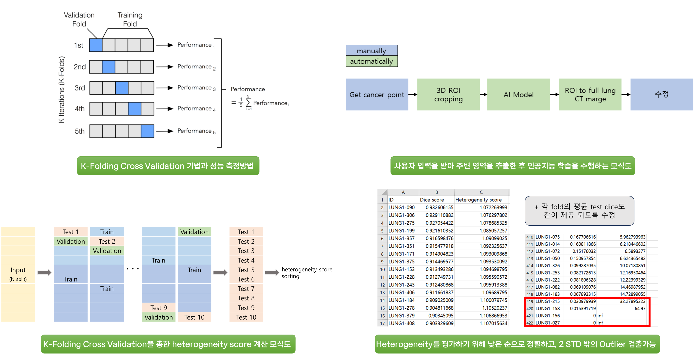

# Heterogeneity_Detection

 
**DEVELOPED BY**: MI2RL (울산대학교)

## Abstract

**Development and Enhancement of Software for Evaluating Data Heterogeneity and Detecting Outliers**

- Develop evaluation software that analyzes particularly misclassified data during k-fold cross-validation of the constructed datasets.

- Automatically assess the unique heterogeneity of e- ach dataset based on this analysis.

- Additionally, develop outlier detection software that trains data with methods such as Conditional GANs.

- Analyze clustering in the latent space.

- Detect outliers by measuring how far samples are from the condition center.

## Description

## Usage Notes

### Protocol

**Step 1.** 본인의 data 경로를 data_folder 에 담은 csv 파일 phase.csv 를 준비합니다.

**Step 2.** Run Deepspeed.py.ipynb 파일에 있는 명령어를 실행하거나 또는 아래의 명령어를 실행하여 deepspeed 를 이용한 fold split training을 실행한다.
	deepspeed --include localhost:0,1,2,3 --master_port=29508 1_train_heterogeneity_deepspeed.py

**Step 3.** 2_Inference_Fold_Result.ipynb 를 실행하여 아래의 폴더에 쌓이는 이미지들중 dice score가 낮은 순서대로 heterogeneity를 체크한다.
	./check_output

### Reference

The nnUNet model was trained using in-house data from Asan Medical Center (AMC), which includes a large set of curated medical images for aorta segmentation.

## Files
⬇️ [Download SW](https://github.com/mi2rl/DataCuration/tree/386eafa30667b9558f4d24ee702955b75d36a4fd/Heterogeneity_Detection)

## Contributing

If you'd like to contribute, or have any suggestions for these guidelines, you can contact us at junegoo.lee@gmail.com or open an issue on this GitHub repository.
